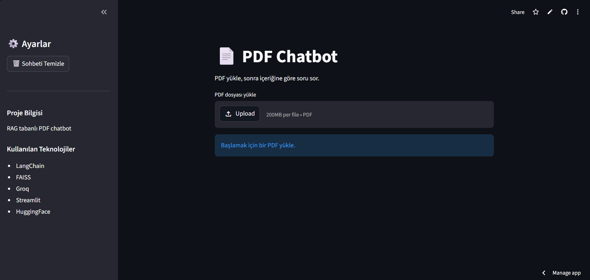

# 📄 PDF Chatbot with RAG

AI-powered PDF chatbot built with Retrieval-Augmented Generation (RAG).

Users can upload PDF files, ask questions about the content, and receive grounded answers generated by an LLM using semantic retrieval.

---

# 🚀 Live Demo

Add your Streamlit deployment link here:

```text
https://pdf-chatbot-rag-ovlzaxzkj4b4qqnwk5dhva.streamlit.app
```

---

# ✨ Features

- 📂 PDF Upload
- 🔎 Semantic Search
- 🧠 Retrieval-Augmented Generation (RAG)
- 🤖 Groq LLM Integration
- 📚 Source Citation
- 💬 Chat History
- 🌐 Streamlit Web Interface
- ⚡ FAISS Vector Database
- 🔗 LangChain Integration

---

# 🛠️ Tech Stack

| Technology | Usage |
|---|---|
| Python | Backend |
| LangChain | RAG orchestration |
| FAISS | Vector database |
| HuggingFace Embeddings | Text embeddings |
| Groq API | LLM inference |
| Streamlit | Web interface |

---

# 🧠 Architecture

```text
PDF Upload
    ↓
Text Chunking
    ↓
Embeddings Generation
    ↓
FAISS Vector Store
    ↓
Semantic Retrieval
    ↓
LLM Context Injection
    ↓
Answer Generation
```

---

# 📸 Screenshots

## Chat Interface

Add screenshots here.

```md

```

---

# ⚙️ Installation

## 1. Clone Repository

```bash
git clone https://github.com/mehmet145-web/pdf-chatbot-rag.git
cd pdf-chatbot-rag
```

---

## 2. Create Virtual Environment

### Windows

```bash
python -m venv .venv
.\.venv\Scripts\activate
```

---

## 3. Install Requirements

```bash
pip install -r requirements.txt
```

---

## 4. Add Environment Variables

Create a `.env` file:

```env
GROQ_API_KEY=your_api_key
```

---

## 5. Run Application

```bash
streamlit run app.py
```

---

# 📂 Project Structure

```text
pdf-chatbot-rag/
│
├── app.py
├── requirements.txt
├── README.md
├── .gitignore
│
├── src/
│   ├── load_pdf.py
│   ├── build_vectorstore.py
│   └── rag_chain.py
│
├── data/
├── vectorstore/
└── screenshots/
```

---

# 🔍 Example Questions

```text
- Summarize the first topic
- What is a tautology?
- Explain World War II
- What are relations in discrete mathematics?
```

---

# 📈 Future Improvements

- OCR support
- Hybrid search
- Multi-PDF support
- Docker deployment
- Better reranking
- Conversational memory
- Authentication system

---

# 🧩 Challenges Faced

This project involved solving several real-world AI engineering problems:

- Hallucination reduction
- Retrieval quality tuning
- Chunking optimization
- PDF parsing issues
- Semantic search relevance
- Streamlit deployment debugging

---

# 👨‍💻 Author

Mehmet Olgun

GitHub:
```text
https://github.com/mehmet145-web
```

---

# 📄 License

MIT License